# Configuring a Cisco Meraki Firewall (Layer 3 Rules, VLAN Segmentation)

Hands-on build documenting how Layer 3 firewall rules work in the Cisco Meraki dashboard, using a self-provisioned Meraki trial organization (MX-based security appliance, cloud-managed). This closes a recurring gap seen across job postings: no direct experience with Meraki's cloud-dashboard management model, as distinct from traditional CLI-managed or on-prem firewalls like pfSense/FortiGate.

## Why a self-provisioned org instead of the Cisco DevNet sandbox

Cisco's DevNet Reservable Meraki Sandbox was the first option tried. As of this build, that sandbox only grants **Observer (read-only)** access — intentional, since it's designed for developers testing the Meraki Dashboard API, webhooks, and other integrations against a pre-built org, not for hands-on GUI administration.

Since the goal here was dashboard-admin configuration experience (the skill most cloud/sysadmin postings are actually asking about), the build pivoted to a free personal Meraki trial organization instead. A self-created org grants **Full access** by default, since you're the sole administrator.

**Honest scope note:** this is a cloud-hosted trial org with zero physical/virtual devices claimed. It demonstrates dashboard-level configuration and Layer 3 policy logic, not device-level traffic handling on real hardware.

## Network layout

| Item | Value |
|---|---|
| Organization | AntSys Branch Office |
| Security appliance type | MX-based (not IOS XE) |
| VLAN 1 (Default) | 192.168.128.1/24 |
| VLAN 10 (Test Office AP) | 10.10.10.1/24 |
| SSID | Test-Office-Wireless, tagged to VLAN 10 |

VLAN 10 was created specifically to represent an office wireless network that should be segmented away from the main LAN (VLAN 1) — a standard real-world pattern for guest/BYOD wireless.

## Starting point: Meraki's default Layer 3 rules

Before any custom rule is added, Meraki ships every network with two default rules:

- **Inbound: Deny, Any → Any**
- **Outbound: Allow, Any → Any**

This is the same default-deny-inbound / default-allow-outbound posture used in FortiGate and pfSense — the underlying security concept doesn't change across vendors, only the terminology and interface do.

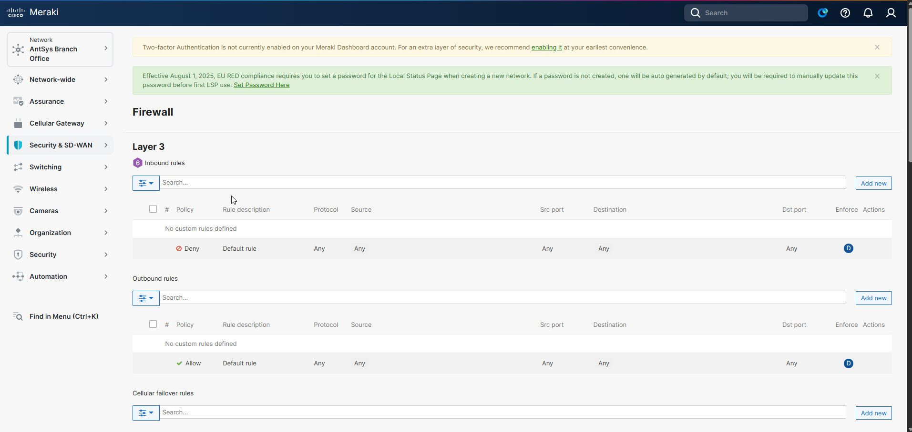

## Rule 1: Isolate VLAN 10 from the main LAN (Inbound)

**Goal:** wireless clients on VLAN 10 should never be able to reach devices on VLAN 1.

Meraki's Layer 3 rule fields don't accept a plain IPv4 CIDR in the Source/Destination fields — only `Any`, an IPv6 CIDR, or a VLAN object:

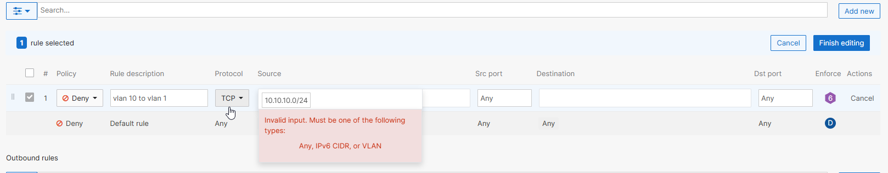

The correct syntax references the VLAN directly (`VLAN(10)`), which Meraki resolves into a proper VLAN object chip:

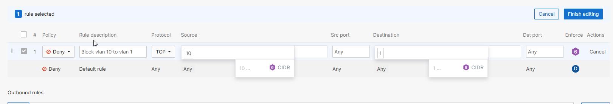

Completed rule — **Deny, Any protocol, Test Office AP (VLAN 10) → Default (VLAN 1)** — placed above the default Deny Any/Any rule (order doesn't change the outcome here since both are Deny, but placement still matters as a matter of process):

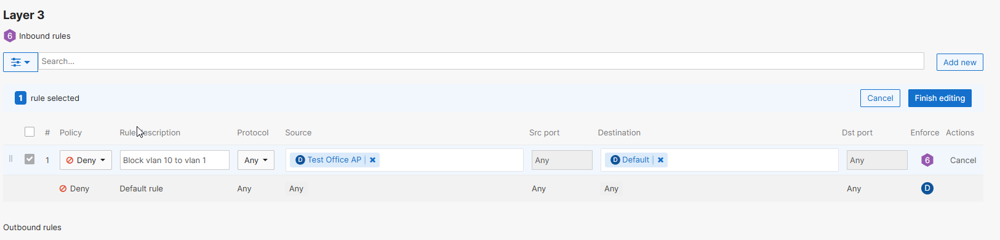

## Rule 2: Restrict VLAN 10's outbound traffic to web only (Outbound)

**Goal:** VLAN 10 devices should only be able to reach the internet over HTTP/HTTPS (ports 80/443) — a common lockdown pattern for guest or restricted-use wireless.

First pass correctly combined both ports into a single Dst port field (`80, 443` — no need for two separate rules per port), but mistakenly restricted the *Src port* field to 80/443 as well:

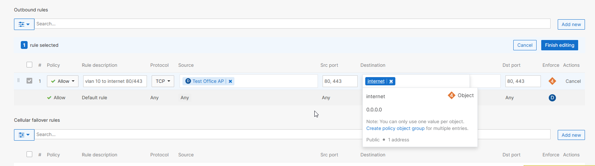

Source port for an outbound web request is a random high-numbered port assigned by the client OS, not 80/443 — that restriction only belongs on the *destination* side. Corrected:

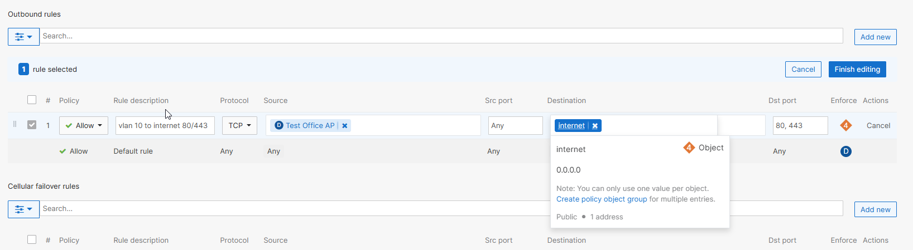

On its own, this Allow 80/443 rule doesn't actually restrict anything — the existing default Allow Any/Any rule below it lets everything else through regardless, making the new rule a no-op. A second rule is needed to close that gap. First attempt scoped the protocol to TCP only, which would miss non-TCP traffic (e.g. UDP/DNS) and let it fall through to the default Allow:

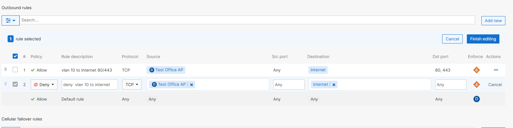

Corrected to Protocol: Any, so all other outbound traffic from VLAN 10 is caught:

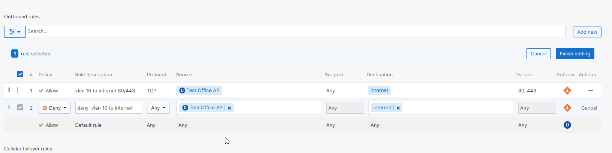

## Final ruleset

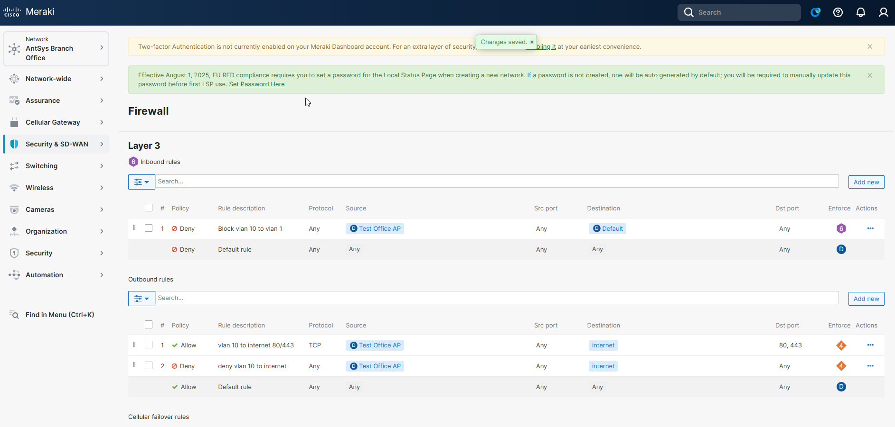

Effective behavior:
1. VLAN 10 cannot reach VLAN 1 (any protocol, any port) — inbound isolation
2. VLAN 10 can reach the internet only on TCP 80/443
3. VLAN 10 is denied all other outbound traffic
4. Every other VLAN is unaffected, still covered by the original Allow Any/Any default

Rule order matters here: the Allow 80/443 rule sits above the Deny Any/Any rule, which sits above the original default Allow. Meraki evaluates rules top-down, first match wins — reversing rules 1 and 2 would make the Allow rule unreachable.

## Validation approach

No physical or virtual devices were claimed on this network, so no live traffic exists to generate real hit-counts or event-log entries — the Meraki dashboard's Event Log and per-rule enforcement icons (which only indicate IPv4 vs. IPv6 scope, not traffic hits) confirmed this directly. Rather than treat that as a dead end, validation here focused on what a config-only build can actually prove:

- **Config acceptance** — each change returned an explicit "Changes saved" confirmation from the dashboard
- **Cross-reference check** — the VLAN ID referenced on the wireless SSID (10) matches the VLAN actually defined under Addressing & VLANs (10), with no subnet overlap against VLAN 1

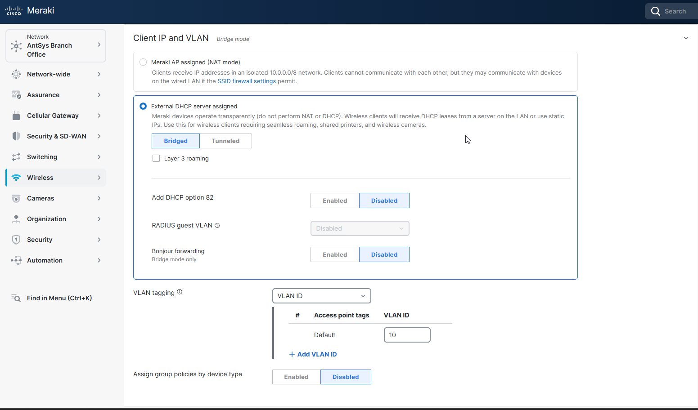
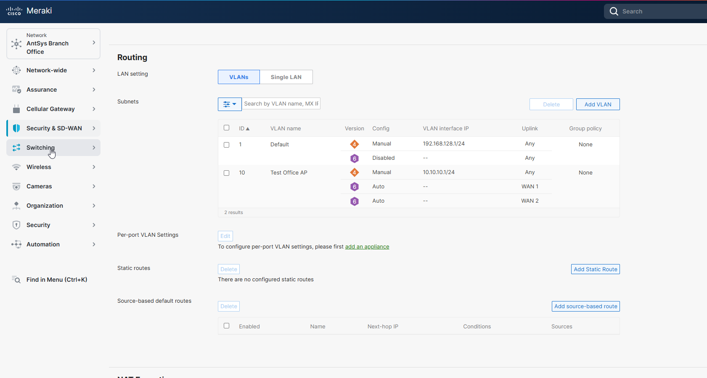

## Takeaways

- Cisco's DevNet sandbox and a self-provisioned trial org serve different audiences: the sandbox is built for API/integration developers (hence Observer-only access), while a personal trial org is the right path for hands-on dashboard administration practice.
- Meraki's default-deny-inbound / default-allow-outbound posture is conceptually identical to FortiGate and pfSense — the model transfers, only the UI and object syntax (VLAN objects instead of raw CIDR in some fields) differ.
- A single Allow rule is not self-enforcing in a default-allow environment — it has to be paired with an explicit Deny to actually restrict traffic, otherwise the default rule beneath it renders it a no-op.
